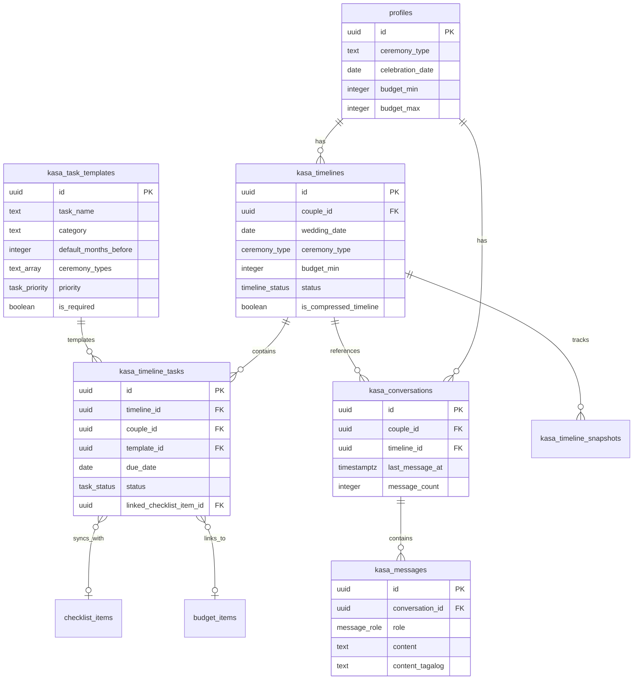

# Kasa AI Wedding Planning Assistant - Technical Architecture

> Complete technical specification for implementing Kasa, the AI wedding planning assistant for everaftr (haraya).

---

## Table of Contents

1. [Overview](#1-overview)
2. [AI Backend Recommendation](#2-ai-backend-recommendation)
3. [Database Schema](#3-database-schema)
4. [Timeline Generation Algorithm](#4-timeline-generation-algorithm)
5. [API Design](#5-api-design)
6. [Frontend Integration](#6-frontend-integration)
7. [Data Flow & Integration](#7-data-flow--integration)
8. [Filipino Wedding Timeline Data Model](#8-filipino-wedding-timeline-data-model)
9. [Implementation Roadmap](#9-implementation-roadmap)
10. [Cost Analysis](#10-cost-analysis)

---

## 1. Overview

### What is Kasa?

**Kasa** (Tagalog for "partner" / "companion") is an AI wedding planning assistant that generates personalized wedding timelines based on Filipino ceremony types and provides conversational support in Taglish.

### Core Capabilities

1. **Timeline Generation**: Creates month-by-month (12mo) or week-by-week (3mo) wedding planning timelines
2. **Progress Tracking**: Monitors task completion against generated timeline
3. **Taglish Q&A**: Answers wedding planning questions in Filipino-English mix
4. **Tool Integration**: Syncs with existing checklist, budget tracker, and vendor directory
5. **Filipino-Specific Knowledge**: Understands CENOMAR, Pre-Cana, Barong fittings, church requirements, etc.

### Key Requirements

- Support all ceremony types: Catholic, INC, Muslim, Civil, Civil Union, Other
- Handle compressed timelines (wedding in 3 months vs. 12+ months)
- Generate ceremony-specific tasks (e.g., Pre-Cana for Catholic, Nikah for Muslim)
- Provide advice in Taglish (code-mixing Filipino and English)
- Connect generated tasks to existing tools (checklist, budget, vendors)

---

## 2. AI Backend Recommendation

### Option A: Claude API (Anthropic) - Full Conversational AI

**Architecture:**
```
User Message → Supabase Edge Function → Claude API → Taglish Response → Database → User
```

**Pros:**
- Natural language understanding - handles free-form questions
- Context-aware conversations - remembers previous chat history
- Can generate Taglish responses naturally
- Understands nuance and edge cases
- No need to build complex rule engine
- Can adapt to user's unique situation

**Cons:**
- Per-token cost (but Claude Haiku is very affordable)
- Requires API key management
- Response time 1-3 seconds per message
- Need prompt engineering for Taglish output

**Cost Estimate (Claude 3.5 Haiku):**
- Input: $0.25 / million tokens
- Output: $1.25 / million tokens
- Average timeline generation: ~2,000 tokens input + 3,000 tokens output = $0.01 per generation
- Average chat message: ~500 tokens input + 800 tokens output = $0.001 per message
- **100 users generating timelines + 50 messages each = ~$6/month**

**When to Use:**
- You want natural conversational AI
- Budget allows $10-50/month for AI
- You want to iterate quickly without building complex rules

---

### Option B: Rule-Based Engine - Structured Timeline Generation

**Architecture:**
```
Input Parameters → Algorithm → Database Query → Task Assembly → Timeline Output
```

**Pros:**
- Deterministic - same inputs = same output
- Fast - no API latency
- Zero per-request cost
- Full control over logic
- Easy to debug and test
- No API dependency

**Cons:**
- Cannot handle free-form questions (only structured timeline generation)
- Rigid - hard to adapt to edge cases
- Taglish responses must be pre-written
- Significant development time to build rule engine
- Hard to scale complexity (many ceremony types × budget ranges × timeframes)

**Cost Estimate:**
- Development time: 40+ hours to build comprehensive rule engine
- Ongoing cost: $0 (no API fees)

**When to Use:**
- Budget is extremely constrained
- Only need timeline generation (not conversational Q&A)
- Have development resources to build and maintain rules

---

### Option C: Hybrid - Rule-Based Timeline + Claude Q&A (RECOMMENDED)

**Architecture:**
```
Timeline Generation: Input → Algorithm → Database → Timeline
Chat Q&A: User Question → Edge Function → Claude API → Taglish Answer
```

**Pros:**
- Best of both worlds: fast deterministic timelines + natural conversation
- Lower AI costs (only chat uses Claude)
- Timeline generation is fast and free
- Can iterate on chat experience independently
- Reduced complexity vs pure rule-based
- Claude handles edge cases and nuance

**Cons:**
- Two systems to maintain
- Still need to build timeline generation algorithm
- Chat still costs money (but much less than Option A)

**Cost Estimate:**
- Timeline generation: $0 (rule-based)
- Chat Q&A: ~1,000 messages/month × $0.001 = $1-3/month
- **Total: $3-5/month for 100 active users**

**Why This is Recommended:**
1. **Timeline generation is well-defined** - we know the rules (ceremony type, months before, budget, etc.). A rule-based system works perfectly here.
2. **Chat needs flexibility** - users ask unpredictable questions about venues, traditions, budgets. Claude excels at this.
3. **Cost-effective** - Only pay for chat, not every timeline generation
4. **Fast timelines** - No API latency for timeline generation
5. **Scalable** - Timeline logic is in database; Claude handles long tail of questions

---

## 3. Database Schema

### Overview

Six new tables integrate with existing schema:

1. **kasa_task_templates** - Master task library (53+ tasks covering all ceremony types)
2. **kasa_timelines** - Generated timelines per couple
3. **kasa_timeline_tasks** - Individual task instances in a timeline
4. **kasa_conversations** - Chat conversation threads
5. **kasa_messages** - Individual messages in conversations
6. **kasa_timeline_snapshots** - Progress tracking for analytics

### Entity Relationship Diagram



### Key Design Decisions

#### 1. Separation of Template vs. Instance

- **kasa_task_templates**: Master library of all possible tasks (53+ tasks)
- **kasa_timeline_tasks**: Specific instances for a couple's timeline
- **Why**: Templates are reusable; instances are customizable per couple

#### 2. Timeline Status Tracking

**kasa_timelines** has computed fields updated via triggers:
- `total_tasks`, `completed_tasks`, `overdue_tasks`, `progress_percentage`
- Updated automatically when tasks change status
- Efficient querying without scanning all tasks

#### 3. Multi-Ceremony Support

Tasks have `ceremony_types` array:
```sql
ARRAY['Catholic', 'Church (INC)', 'Muslim', 'Civil']
```
Timeline generation filters tasks based on couple's ceremony type.

#### 4. Integration Points

- **linked_checklist_item_id**: Syncs timeline task with main checklist
- **linked_budget_item_id**: Links task to budget line item
- **linked_vendor_category**: Suggests vendor type to browse

#### 5. Taglish Support

Messages and tasks have dual-language fields:
- `content` (English) + `content_tagalog` (Taglish)
- `description` (English) + `description_tagalog` (Tagalog)

Allows UI to show preferred language based on user settings.

---

## 4. Timeline Generation Algorithm

### High-Level Flow

```
1. Receive input: wedding_date, ceremony_type, budget_range, location, guest_count
2. Calculate months_until_wedding
3. Determine if compressed timeline (< 3 months)
4. Query kasa_task_templates filtered by ceremony_type
5. If compressed: apply compression rules (drop, combine, accelerate)
6. Calculate due_date for each task: wedding_date - default_months_before
7. Sort by due_date, apply dependencies
8. Insert into kasa_timelines + kasa_timeline_tasks
9. Return timeline_id
```

### Detailed Algorithm Pseudocode

```typescript
async function generateTimeline(input: TimelineInput): Promise<Timeline> {
  const { weddingDate, ceremonyType, budgetMin, budgetMax, guestCount, location, coupleId } = input;

  // 1. Calculate timeline parameters
  const today = new Date();
  const monthsUntilWedding = getMonthsDifference(today, weddingDate);
  const isCompressedTimeline = monthsUntilWedding < 3;

  // 2. Determine budget range enum
  const budgetRange = categorizeBudget(budgetMin, budgetMax);

  // 3. Query task templates
  const allTasks = await queryTaskTemplates({
    ceremonyTypes: [ceremonyType],
    budgetRanges: [budgetRange],
    isActive: true
  });

  // 4. Filter and customize tasks
  let applicableTasks = allTasks.filter(task => {
    // Must match ceremony type
    if (!task.ceremony_types.includes(ceremonyType)) return false;

    // Check budget applicability
    if (task.required_budget_ranges.length > 0 &&
        !task.required_budget_ranges.includes(budgetRange)) {
      return false;
    }

    // If task requires advance booking beyond available time, flag it
    if (task.advance_booking_months > monthsUntilWedding) {
      task.priority = 'critical'; // Urgent!
      task.ai_notes = `Mas mabilis dapat - normally need ${task.advance_booking_months} months but you only have ${monthsUntilWedding}`;
    }

    return true;
  });

  // 5. Apply compression rules if needed
  if (isCompressedTimeline) {
    applicableTasks = applyCompressionRules(applicableTasks, monthsUntilWedding);
  }

  // 6. Calculate due dates
  const timelineTasks = applicableTasks.map(template => {
    let dueDate = new Date(weddingDate);

    if (isCompressedTimeline) {
      // Compress timeline proportionally
      const compressionFactor = monthsUntilWedding / 12;
      const adjustedMonthsBefore = Math.ceil(template.default_months_before * compressionFactor);
      dueDate.setMonth(dueDate.getMonth() - adjustedMonthsBefore);
    } else {
      dueDate.setMonth(dueDate.getMonth() - template.default_months_before);
    }

    // Don't set due dates in the past
    if (dueDate < today) {
      dueDate = new Date(today);
      dueDate.setDate(dueDate.getDate() + 7); // Give 1 week
    }

    return {
      template_id: template.id,
      task_name: template.task_name,
      description: template.description,
      category: template.category,
      due_date: dueDate,
      priority: template.priority,
      status: 'not_started',
      is_ceremony_specific: template.is_catholic_only || template.is_muslim_only || template.is_civil_only,
      linked_vendor_category: template.vendor_categories?.[0] || null,
      tips: template.tips,
      ai_notes: generateCustomNote(template, input)
    };
  });

  // 7. Sort by due date, then priority
  timelineTasks.sort((a, b) => {
    if (a.due_date < b.due_date) return -1;
    if (a.due_date > b.due_date) return 1;
    return getPriorityScore(b.priority) - getPriorityScore(a.priority);
  });

  // 8. Insert into database
  const timeline = await db.insert('kasa_timelines', {
    couple_id: coupleId,
    wedding_date: weddingDate,
    ceremony_type: ceremonyType,
    budget_min: budgetMin,
    budget_max: budgetMax,
    guest_count: guestCount,
    location: location,
    is_compressed_timeline: isCompressedTimeline,
    generation_notes: isCompressedTimeline ? 'Compressed 3-month timeline generated' : 'Standard 12-month timeline',
    status: 'active',
    total_tasks: timelineTasks.length
  });

  await db.insertBatch('kasa_timeline_tasks', timelineTasks.map((task, index) => ({
    ...task,
    timeline_id: timeline.id,
    couple_id: coupleId,
    sort_order: index
  })));

  return timeline;
}
```

### Compression Rules (3-Month Timeline)

When `monthsUntilWedding < 3`:

#### Tasks to DROP:
- **Non-critical, low priority tasks**: Programs/menus, signage, photo booth souvenirs
- **Long-lead vendor bookings** if already past booking window: Some venues, top-tier photographers
- **Optional traditions**: Cord/veil sponsors, arrhae if not important to couple

#### Tasks to COMBINE:
- "Book Hair & Makeup" + "Hair & Makeup Trial" → Single task with accelerated timeline
- "Get Baptismal Cert" + "Get Confirmation Cert" → Request both at once
- "Order Invitations" + "Design Invitations" → Use faster print service or digital invites

#### Tasks to ACCELERATE (move to CRITICAL priority):
- **Government documents**: CENOMAR, birth certificates, marriage license (MOST URGENT)
- **Venue bookings**: If not yet booked, this is critical path
- **Primary vendors**: Photographer, caterer, coordinator
- **Ceremony requirements**: Pre-Cana, church coordination, marriage license application

#### Sample Compressed Timeline (3 months / 12 weeks):

```
Week 1-2 (CRITICAL):
- Apply for CENOMAR and Birth Certificates immediately (online if possible)
- Apply for marriage license (10-day waiting period!)
- Book ceremony venue (if available)
- Book reception venue (if available)

Week 3-4 (HIGH):
- Book photographer/videographer
- Book caterer
- Book coordinator
- Register for Pre-Cana (or fast-track if church allows)

Week 5-6 (HIGH):
- Pick up marriage license after waiting period
- Book florist, hair/makeup, lights/sound
- Start shopping for attire (rush tailoring if needed)

Week 7-8 (MEDIUM):
- Order wedding cake
- Invite principal sponsors
- Book entertainment (band/DJ)
- Order invitations (rush printing or go digital)

Week 9-10 (MEDIUM):
- Finalize guest list
- Complete attire fittings
- Hair & makeup trial
- Get baptismal/confirmation certificates

Week 11 (HIGH):
- Final church coordination meeting
- Confirm all vendors
- Create seating chart and timeline
- Prepare payments

Week 12 (CRITICAL):
- Final preparations, rest, pack bags
- Wedding day!
```

### Filipino-Specific Logic

#### CENOMAR Processing Time

```typescript
if (task.task_name === 'Get CENOMAR from PSA') {
  const cenomar_processing_weeks = 4;
  const weeks_until_wedding = monthsUntilWedding * 4;

  if (weeks_until_wedding < 10) {
    task.ai_notes = 'URGENT: CENOMAR takes 3-4 weeks. Apply ASAP online via PSA Serbilis!';
    task.priority = 'critical';
  }
}
```

#### Pre-Cana Advance Booking

```typescript
if (task.task_name === 'Attend Pre-Cana Seminar' && ceremonyType === 'Catholic') {
  if (monthsUntilWedding < 6) {
    task.ai_notes = 'Pre-Cana slots usually book 6+ months ahead. Call multiple parishes NOW to find available slots. Some offer weekend intensives.';
    task.priority = 'critical';
  }
}
```

#### Church Booking for Peak Seasons

```typescript
if (task.task_name === 'Book Ceremony Venue' && ceremonyType === 'Catholic') {
  const weddingMonth = weddingDate.getMonth();
  const peakMonths = [0, 3, 4, 11]; // January, April, May, December

  if (peakMonths.includes(weddingMonth)) {
    task.ai_notes = 'Peak season! Popular Manila churches (BGC, Makati) book 12-18 months ahead. Consider weekday or morning ceremony for better availability.';
  }
}
```

#### Budget-Based Task Filtering

```typescript
function applyBudgetFilter(task: TaskTemplate, budgetRange: BudgetRange): boolean {
  // Example: Photo booth is optional for lower budgets
  if (task.task_name.includes('Photo Booth') && budgetRange === 'below_100k') {
    return false; // Drop this task
  }

  // Example: Coordinator highly recommended for 500k+ budgets
  if (task.task_name.includes('Coordinator') && budgetRange === 'above_1m') {
    task.priority = 'critical';
    task.ai_notes = 'With your budget, a coordinator is essential to manage all suppliers smoothly.';
  }

  return true;
}
```

---

## 5. API Design

### Supabase Edge Functions Architecture

All Kasa APIs will be implemented as **Supabase Edge Functions** (Deno-based serverless functions).

```
Client → Supabase Edge Function → Business Logic → Supabase Database → Response
```

**Benefits:**
- Co-located with database (low latency)
- Automatic authentication via Supabase JWT
- TypeScript support
- Easy deployment
- Free tier: 500K requests/month

---

### API Endpoints

#### 1. POST /api/kasa/generate-timeline

**Purpose**: Generate a personalized wedding planning timeline.

**Request:**
```typescript
{
  wedding_date: "2026-12-15",         // ISO date string
  ceremony_type: "Catholic",          // ceremony_type enum
  budget_min: 300000,                 // PHP
  budget_max: 500000,                 // PHP
  guest_count: 150,                   // number
  location: "Manila"                  // string
}
```

**Response:**
```typescript
{
  timeline_id: "uuid",
  status: "active",
  total_tasks: 42,
  is_compressed_timeline: false,
  generation_notes: "Standard 12-month timeline generated",
  tasks_preview: [
    {
      task_name: "Get CENOMAR from PSA",
      due_date: "2026-08-15",
      priority: "critical",
      category: "Documents"
    },
    // ... first 5 tasks
  ],
  next_steps: [
    "Start with government documents - CENOMAR and birth certificates",
    "Book your ceremony venue - Catholic churches need 6-10 months advance",
    "Apply for marriage license 3 months before wedding"
  ]
}
```

**Edge Function Implementation:**

```typescript
// supabase/functions/kasa-generate-timeline/index.ts
import { serve } from 'https://deno.land/std@0.168.0/http/server.ts';
import { createClient } from 'https://esm.sh/@supabase/supabase-js@2';

serve(async (req) => {
  try {
    // 1. Verify authentication
    const authHeader = req.headers.get('Authorization');
    if (!authHeader) {
      return new Response(JSON.stringify({ error: 'Unauthorized' }), {
        status: 401,
        headers: { 'Content-Type': 'application/json' }
      });
    }

    // 2. Initialize Supabase client
    const supabase = createClient(
      Deno.env.get('SUPABASE_URL')!,
      Deno.env.get('SUPABASE_SERVICE_ROLE_KEY')!
    );

    // 3. Get user from token
    const { data: { user }, error: authError } = await supabase.auth.getUser(
      authHeader.replace('Bearer ', '')
    );

    if (authError || !user) {
      return new Response(JSON.stringify({ error: 'Invalid token' }), { status: 401 });
    }

    // 4. Parse request body
    const body = await req.json();
    const { wedding_date, ceremony_type, budget_min, budget_max, guest_count, location } = body;

    // 5. Validate inputs
    if (!wedding_date || !ceremony_type) {
      return new Response(JSON.stringify({ error: 'Missing required fields' }), { status: 400 });
    }

    // 6. Generate timeline (call algorithm)
    const timeline = await generateTimeline({
      coupleId: user.id,
      weddingDate: new Date(wedding_date),
      ceremonyType: ceremony_type,
      budgetMin: budget_min,
      budgetMax: budget_max,
      guestCount: guest_count,
      location: location
    }, supabase);

    // 7. Return response
    return new Response(JSON.stringify(timeline), {
      status: 200,
      headers: { 'Content-Type': 'application/json' }
    });

  } catch (error) {
    console.error('Error generating timeline:', error);
    return new Response(JSON.stringify({ error: 'Internal server error' }), { status: 500 });
  }
});
```

---

#### 2. POST /api/kasa/chat

**Purpose**: Send a message to Kasa and get a conversational response.

**Request:**
```typescript
{
  conversation_id?: "uuid",  // Optional: existing conversation
  timeline_id?: "uuid",      // Optional: reference to timeline
  message: "Paano ba kumuha ng CENOMAR? How long does it take?",
  include_context: true      // Include timeline context in AI prompt
}
```

**Response:**
```typescript
{
  message_id: "uuid",
  conversation_id: "uuid",
  content: "Madali lang kumuha ng CENOMAR! You can apply online via PSA Serbilis (psaserbilis.com.ph)...",
  referenced_tasks: [
    {
      task_id: "uuid",
      task_name: "Get CENOMAR from PSA",
      due_date: "2026-08-15"
    }
  ],
  suggested_actions: [
    {
      action: "view_task",
      task_id: "uuid",
      label: "View CENOMAR task in your timeline"
    },
    {
      action: "external_link",
      url: "https://psaserbilis.com.ph",
      label: "Go to PSA Serbilis"
    }
  ]
}
```

**Edge Function with Claude Integration:**

```typescript
// supabase/functions/kasa-chat/index.ts
import { serve } from 'https://deno.land/std@0.168.0/http/server.ts';
import { createClient } from 'https://esm.sh/@supabase/supabase-js@2';
import Anthropic from 'https://esm.sh/@anthropic-ai/sdk@0.20.0';

serve(async (req) => {
  try {
    const supabase = createClient(
      Deno.env.get('SUPABASE_URL')!,
      Deno.env.get('SUPABASE_SERVICE_ROLE_KEY')!
    );

    const authHeader = req.headers.get('Authorization');
    const { data: { user } } = await supabase.auth.getUser(
      authHeader!.replace('Bearer ', '')
    );

    const body = await req.json();
    const { conversation_id, timeline_id, message, include_context } = body;

    // 1. Get or create conversation
    let conversationId = conversation_id;
    if (!conversationId) {
      const { data: newConversation } = await supabase
        .from('kasa_conversations')
        .insert({
          couple_id: user!.id,
          timeline_id: timeline_id,
          conversation_name: `Chat ${new Date().toLocaleDateString()}`
        })
        .select()
        .single();
      conversationId = newConversation.id;
    }

    // 2. Get conversation history
    const { data: history } = await supabase
      .from('kasa_messages')
      .select('role, content')
      .eq('conversation_id', conversationId)
      .order('created_at', { ascending: true })
      .limit(20);

    // 3. Build context from timeline if requested
    let timelineContext = '';
    if (include_context && timeline_id) {
      const { data: timeline } = await supabase
        .from('kasa_timelines')
        .select(`
          *,
          kasa_timeline_tasks (
            task_name,
            due_date,
            status,
            priority
          )
        `)
        .eq('id', timeline_id)
        .single();

      timelineContext = `
User's Wedding Details:
- Wedding Date: ${timeline.wedding_date}
- Ceremony Type: ${timeline.ceremony_type}
- Location: ${timeline.location}
- Budget Range: PHP ${timeline.budget_min?.toLocaleString()} - ${timeline.budget_max?.toLocaleString()}

Upcoming Tasks (next 5):
${timeline.kasa_timeline_tasks
  .filter(t => t.status !== 'completed')
  .slice(0, 5)
  .map(t => `- ${t.task_name} (due ${t.due_date}, ${t.priority} priority)`)
  .join('\n')}
`;
    }

    // 4. Call Claude API
    const anthropic = new Anthropic({
      apiKey: Deno.env.get('ANTHROPIC_API_KEY')!
    });

    const systemPrompt = `You are Kasa, the AI wedding planning assistant for everaftr, the Philippines' first inclusive wedding planning platform.

Your personality:
- Warm, supportive, and encouraging (parang ate or kuya helping plan)
- Speak in Taglish (mix Filipino and English naturally)
- Expert on Filipino weddings: Catholic, INC, Muslim, Civil ceremonies
- Know Filipino-specific requirements: CENOMAR, Pre-Cana, Barong, church bookings, etc.
- Practical and budget-conscious

Key knowledge:
- CENOMAR processing: 3-4 weeks via PSA Serbilis
- Pre-Cana booking: 6+ months advance for popular parishes
- Catholic church bookings: 6-12 months for peak seasons (Dec, Jan, Apr, May)
- Marriage license: 10-day waiting period, valid 120 days
- Popular vendors book 12+ months ahead in Metro Manila
- Always use inclusive language: "celebration" not just "wedding", "you and your partner" not "bride and groom"

${timelineContext}

Respond naturally in Taglish. Be helpful, specific, and encouraging.`;

    const response = await anthropic.messages.create({
      model: 'claude-3-5-haiku-20241022',
      max_tokens: 1024,
      system: systemPrompt,
      messages: [
        ...history.map(m => ({ role: m.role, content: m.content })),
        { role: 'user', content: message }
      ]
    });

    const assistantMessage = response.content[0].text;

    // 5. Save messages to database
    await supabase.from('kasa_messages').insert([
      {
        conversation_id: conversationId,
        couple_id: user!.id,
        role: 'user',
        content: message,
        referenced_timeline_id: timeline_id
      },
      {
        conversation_id: conversationId,
        couple_id: user!.id,
        role: 'assistant',
        content: assistantMessage,
        ai_model: 'claude-3-5-haiku-20241022',
        prompt_tokens: response.usage.input_tokens,
        completion_tokens: response.usage.output_tokens
      }
    ]);

    // 6. Return response
    return new Response(JSON.stringify({
      conversation_id: conversationId,
      content: assistantMessage,
      // TODO: Extract referenced tasks and suggested actions via parsing
    }), {
      status: 200,
      headers: { 'Content-Type': 'application/json' }
    });

  } catch (error) {
    console.error('Error in chat:', error);
    return new Response(JSON.stringify({ error: 'Internal server error' }), { status: 500 });
  }
});
```

---

#### 3. GET /api/kasa/timeline/:id

**Purpose**: Fetch a generated timeline with all tasks.

**Request:**
```
GET /api/kasa/timeline/abc-123-def-456
```

**Response:**
```typescript
{
  timeline: {
    id: "uuid",
    wedding_date: "2026-12-15",
    ceremony_type: "Catholic",
    status: "active",
    total_tasks: 42,
    completed_tasks: 8,
    progress_percentage: 19.05,
    is_compressed_timeline: false,
    created_at: "2026-02-10T10:00:00Z"
  },
  tasks: [
    {
      id: "uuid",
      task_name: "Get CENOMAR from PSA",
      description: "Certificate of No Marriage Record is required...",
      category: "Documents",
      due_date: "2026-08-15",
      status: "completed",
      priority: "critical",
      is_ceremony_specific: false,
      linked_vendor_category: null,
      tips: [
        "Order online via PSA Serbilis...",
        "Processing takes 3-4 weeks"
      ],
      couple_notes: "Applied online on Aug 1, received Aug 20",
      completed_date: "2026-08-20"
    },
    // ... all tasks
  ],
  milestones: [
    {
      month: "August 2026",
      task_count: 5,
      critical_count: 3
    },
    // ... grouped by month
  ]
}
```

**Edge Function:**

```typescript
// supabase/functions/kasa-get-timeline/index.ts
serve(async (req) => {
  const url = new URL(req.url);
  const timelineId = url.pathname.split('/').pop();

  const supabase = createClient(...);
  const { data: { user } } = await supabase.auth.getUser(...);

  // Fetch timeline with tasks
  const { data: timeline, error } = await supabase
    .from('kasa_timelines')
    .select(`
      *,
      kasa_timeline_tasks (
        id,
        task_name,
        description,
        category,
        due_date,
        status,
        priority,
        is_ceremony_specific,
        linked_vendor_category,
        linked_checklist_item_id,
        tips,
        couple_notes,
        completed_date,
        sort_order
      )
    `)
    .eq('id', timelineId)
    .eq('couple_id', user!.id)
    .single();

  if (error || !timeline) {
    return new Response(JSON.stringify({ error: 'Timeline not found' }), { status: 404 });
  }

  // Group tasks by month for milestone view
  const milestones = groupTasksByMonth(timeline.kasa_timeline_tasks);

  return new Response(JSON.stringify({
    timeline,
    tasks: timeline.kasa_timeline_tasks,
    milestones
  }), {
    status: 200,
    headers: { 'Content-Type': 'application/json' }
  });
});
```

---

#### 4. PATCH /api/kasa/timeline/:id/tasks/:taskId

**Purpose**: Update task status, add notes, or modify task.

**Request:**
```typescript
{
  status: "completed",           // Update status
  couple_notes: "Applied online on Aug 1",
  completed_date: "2026-08-20"
}
```

**Response:**
```typescript
{
  task: {
    id: "uuid",
    status: "completed",
    couple_notes: "Applied online on Aug 1",
    completed_date: "2026-08-20",
    updated_at: "2026-08-20T15:30:00Z"
  },
  timeline_progress: {
    completed_tasks: 9,
    progress_percentage: 21.43
  }
}
```

---

#### 5. POST /api/kasa/timeline/:id/sync-to-checklist

**Purpose**: Sync timeline tasks to the main checklist tool.

**Request:**
```typescript
{
  sync_all: false,               // Sync all tasks or selected
  task_ids: ["uuid1", "uuid2"]   // If sync_all is false
}
```

**Response:**
```typescript
{
  synced_count: 2,
  checklist_items: [
    {
      id: "uuid",
      title: "Get CENOMAR from PSA",
      category: "Documents",
      due_date: "2026-08-15",
      linked_timeline_task_id: "uuid"
    }
  ]
}
```

**Implementation:**

```typescript
// For each timeline task:
const { data: checklistItem } = await supabase
  .from('checklist_items')
  .insert({
    couple_id: user.id,
    title: task.task_name,
    category: task.category,
    due_date: task.due_date,
    timeframe: calculateTimeframe(task.due_date),
    ceremony_types: [timeline.ceremony_type],
    completed: task.status === 'completed',
    notes: task.description
  })
  .select()
  .single();

// Link back to timeline task
await supabase
  .from('kasa_timeline_tasks')
  .update({ linked_checklist_item_id: checklistItem.id })
  .eq('id', task.id);
```

---

## 6. Frontend Integration

### Page Structure: `/kasa`

The Kasa page will have three main sections:

```
/kasa
├── Timeline View (if timeline exists)
│   ├── Progress bar
│   ├── Month-by-month task list
│   └── Quick actions
├── Chat Interface
│   ├── Message history
│   ├── Input box
│   └── Suggested questions
└── Timeline Generator (if no timeline)
    └── Input form
```

---

### Component Architecture

```
src/pages/Kasa.tsx
├── <KasaHeader /> - Progress overview
├── <TimelineView /> - Month-by-month task view
│   ├── <TaskCard /> - Individual task
│   └── <MonthGroup /> - Tasks grouped by month
├── <ChatInterface /> - Conversation UI
│   ├── <MessageBubble /> - Single message
│   ├── <TypingIndicator /> - AI is typing...
│   └── <ChatInput /> - Message input
└── <TimelineGenerator /> - Initial timeline setup form
```

---

### Timeline View UI

**Monthly View (12-month timeline):**

```
┌─────────────────────────────────────────────────────────┐
│  Your Wedding Timeline                    [🔄 Sync to Checklist] │
│  Progress: 8/42 tasks completed (19%)                   │
│  ████░░░░░░░░░░░░░░░░░░░░░░░░░░░░░░░░░░               │
└─────────────────────────────────────────────────────────┘

┌─ August 2026 ─────────────────────────────────────────┐
│ ⚠️  3 critical tasks │ 5 total tasks                   │
│                                                         │
│ ✅ Get CENOMAR from PSA                   [CRITICAL]    │
│    Applied online Aug 1, received Aug 20               │
│    Documents • Due Aug 15                              │
│                                                         │
│ ⬜ Get PSA Birth Certificates             [CRITICAL]    │
│    Updated birth certificate from PSA is required...   │
│    Documents • Due Aug 15                              │
│    💡 Order via PSA Serbilis - mas mabilis            │
│    [Mark Complete] [Add Note] [View Details]           │
│                                                         │
│ ⬜ Get Baptismal Certificates             [HIGH]        │
│    Required by Catholic churches...                    │
│    Documents • Due Aug 20                              │
│                                                         │
└─────────────────────────────────────────────────────────┘

┌─ September 2026 ──────────────────────────────────────┐
│ 📍 2 high priority │ 4 total tasks                     │
│                                                         │
│ ⬜ Attend Pre-Cana Seminar                [CRITICAL]    │
│    Required marriage preparation seminar...            │
│    Documents • Due Sep 15                              │
│    ⚠️ Book NOW - slots fill up 6+ months ahead        │
│    [Browse Coordination Vendors] [Add Note]            │
│                                                         │
└─────────────────────────────────────────────────────────┘
```

**Weekly View (3-month compressed timeline):**

```
┌─ Week 1-2 (Feb 10-23) ───────────────────────────────┐
│ 🚨 URGENT: 5 critical tasks                           │
│                                                         │
│ ⬜ Apply for CENOMAR and Birth Certificates [CRITICAL] │
│    ⚠️ Start IMMEDIATELY - takes 3-4 weeks processing  │
│    [Apply via PSA Serbilis] [Need Help?]              │
│                                                         │
│ ⬜ Apply for Marriage License              [CRITICAL]   │
│    10-day waiting period required                      │
│    [Find City Hall] [Chat with Kasa]                  │
│                                                         │
└─────────────────────────────────────────────────────────┘
```

---

### Chat Interface UI

```
┌─────────────────────────────────────────────────────────┐
│  Chat with Kasa                            [Minimize] │
└─────────────────────────────────────────────────────────┘

  You                                             10:23 AM
  ┌───────────────────────────────────────────────┐
  │ Paano ba kumuha ng CENOMAR? Gaano katagal?   │
  └───────────────────────────────────────────────┘

                                           Kasa  10:23 AM
  ┌───────────────────────────────────────────────┐
  │ Madali lang kumuha ng CENOMAR! You can apply │
  │ online via PSA Serbilis (psaserbilis.com.ph) │
  │                                                │
  │ Processing time: 3-4 weeks usually           │
  │                                                │
  │ Steps:                                        │
  │ 1. Go to PSA Serbilis website                │
  │ 2. Register account                           │
  │ 3. Order CENOMAR (need birth cert details)   │
  │ 4. Pay online (around PHP 200)               │
  │ 5. Delivered via LBC in 3-4 weeks           │
  │                                                │
  │ Tip: Order now if your wedding is within 6   │
  │ months! Valid for 6 months from issue date.  │
  │                                                │
  │ [View CENOMAR Task] [Go to PSA Serbilis]     │
  └───────────────────────────────────────────────┘

┌─────────────────────────────────────────────────────────┐
│ Type your question...                          [Send] │
└─────────────────────────────────────────────────────────┘

Suggested questions:
• How much does a Catholic wedding cost?
• Where can I find affordable photographers in Manila?
• What documents do I need for a civil wedding?
```

---

### Timeline Generator Form

**Initial state (no timeline yet):**

```
┌─────────────────────────────────────────────────────────┐
│            Generate Your Wedding Timeline               │
│                                                           │
│  Let Kasa create a personalized planning timeline       │
│  based on your celebration details.                     │
│                                                           │
│  Wedding Date *                                          │
│  [____________________]  📅                             │
│                                                           │
│  Ceremony Type *                                         │
│  [ Catholic ▼ ]                                          │
│                                                           │
│  Budget Range                                            │
│  Min: ₱ [___________]  Max: ₱ [___________]            │
│                                                           │
│  Guest Count                                             │
│  [___________] guests                                    │
│                                                           │
│  Location                                                │
│  [___________]                                           │
│                                                           │
│  [ Generate Timeline ]                                   │
│                                                           │
│  💡 Timeline will include Filipino-specific tasks like  │
│     CENOMAR, Pre-Cana, church requirements, and more.   │
└─────────────────────────────────────────────────────────┘
```

**After generation:**

```
┌─────────────────────────────────────────────────────────┐
│  ✅ Timeline Generated!                                  │
│                                                           │
│  We created a 42-task wedding timeline for your          │
│  Catholic celebration on December 15, 2026.             │
│                                                           │
│  Next Steps:                                             │
│  1. Start with CENOMAR and birth certificates          │
│  2. Book your church - 6-10 months advance needed       │
│  3. Apply for marriage license 3 months before          │
│                                                           │
│  [View Full Timeline] [Sync to Checklist] [Chat with Kasa] │
└─────────────────────────────────────────────────────────┘
```

---

### React Component Examples

#### KasaPage.tsx

```tsx
import React, { useState, useEffect } from 'react';
import { useAuth } from '@/hooks/useAuth';
import { supabase } from '@/lib/supabase';
import TimelineView from '@/components/Kasa/TimelineView';
import ChatInterface from '@/components/Kasa/ChatInterface';
import TimelineGenerator from '@/components/Kasa/TimelineGenerator';

export default function KasaPage() {
  const { user } = useAuth();
  const [timeline, setTimeline] = useState(null);
  const [loading, setLoading] = useState(true);
  const [showChat, setShowChat] = useState(false);

  useEffect(() => {
    loadTimeline();
  }, [user]);

  async function loadTimeline() {
    if (!user) return;

    const { data, error } = await supabase
      .from('kasa_timelines')
      .select(`
        *,
        kasa_timeline_tasks (
          id, task_name, due_date, status, priority, category
        )
      `)
      .eq('couple_id', user.id)
      .eq('status', 'active')
      .order('created_at', { ascending: false })
      .limit(1)
      .single();

    if (data) {
      setTimeline(data);
    }
    setLoading(false);
  }

  async function handleGenerateTimeline(params) {
    setLoading(true);

    const response = await fetch('/api/kasa/generate-timeline', {
      method: 'POST',
      headers: {
        'Content-Type': 'application/json',
        'Authorization': `Bearer ${(await supabase.auth.getSession()).data.session?.access_token}`
      },
      body: JSON.stringify(params)
    });

    const result = await response.json();
    await loadTimeline(); // Reload timeline
    setLoading(false);
  }

  if (loading) {
    return <div className="flex justify-center items-center min-h-screen">
      <div className="animate-spin">Loading...</div>
    </div>;
  }

  return (
    <div className="min-h-screen bg-pina-ivory pattern-pina">
      <div className="container mx-auto px-4 py-8">
        <header className="mb-8">
          <h1 className="font-cormorant text-4xl text-accent-primary mb-2">
            Kasa AI Planning Assistant
          </h1>
          <p className="text-text-secondary">
            Your personal guide to planning a Filipino celebration
          </p>
        </header>

        {!timeline ? (
          <TimelineGenerator onGenerate={handleGenerateTimeline} />
        ) : (
          <div className="grid lg:grid-cols-3 gap-6">
            <div className="lg:col-span-2">
              <TimelineView timeline={timeline} onRefresh={loadTimeline} />
            </div>

            <div className="lg:col-span-1">
              <ChatInterface
                timelineId={timeline.id}
                isVisible={showChat}
                onToggle={() => setShowChat(!showChat)}
              />
            </div>
          </div>
        )}
      </div>
    </div>
  );
}
```

#### TaskCard.tsx

```tsx
interface TaskCardProps {
  task: {
    id: string;
    task_name: string;
    description: string;
    due_date: string;
    status: 'not_started' | 'in_progress' | 'completed' | 'overdue';
    priority: 'critical' | 'high' | 'medium' | 'low';
    category: string;
    tips?: string[];
    ai_notes?: string;
    linked_vendor_category?: string;
  };
  onUpdate: (taskId: string, updates: any) => void;
}

export default function TaskCard({ task, onUpdate }: TaskCardProps) {
  const [expanded, setExpanded] = useState(false);
  const [notes, setNotes] = useState('');

  const priorityColors = {
    critical: 'border-accent-error bg-accent-error/10',
    high: 'border-accent-warning bg-accent-warning/10',
    medium: 'border-accent-info bg-accent-info/10',
    low: 'border bg-white'
  };

  const statusIcons = {
    completed: '✅',
    in_progress: '⏳',
    not_started: '⬜',
    overdue: '⚠️'
  };

  async function handleComplete() {
    await onUpdate(task.id, {
      status: 'completed',
      completed_date: new Date().toISOString()
    });
  }

  return (
    <div className={`border-2 rounded-lg p-4 mb-4 ${priorityColors[task.priority]}`}>
      <div className="flex items-start justify-between">
        <div className="flex-1">
          <div className="flex items-center gap-2 mb-1">
            <span className="text-xl">{statusIcons[task.status]}</span>
            <h3 className="font-semibold text-lg">{task.task_name}</h3>
            {task.priority === 'critical' && (
              <span className="text-xs bg-accent-error text-white px-2 py-1 rounded">
                CRITICAL
              </span>
            )}
          </div>

          <div className="flex items-center gap-4 text-sm text-text-secondary mb-2">
            <span>{task.category}</span>
            <span>Due: {new Date(task.due_date).toLocaleDateString()}</span>
          </div>

          {expanded && (
            <>
              <p className="text-sm text-text-secondary mb-3">
                {task.description}
              </p>

              {task.ai_notes && (
                <div className="bg-langkit-violet/10 border-l-4 border-langkit-violet p-3 mb-3">
                  <p className="text-sm">💡 {task.ai_notes}</p>
                </div>
              )}

              {task.tips && task.tips.length > 0 && (
                <div className="mb-3">
                  <p className="text-sm font-semibold mb-1">Tips:</p>
                  <ul className="text-sm space-y-1">
                    {task.tips.map((tip, i) => (
                      <li key={i} className="text-text-secondary">• {tip}</li>
                    ))}
                  </ul>
                </div>
              )}
            </>
          )}
        </div>
      </div>

      <div className="flex gap-2 mt-3">
        {task.status !== 'completed' && (
          <button
            onClick={handleComplete}
            className="px-3 py-1 bg-accent-success text-white rounded text-sm hover:bg-accent-success/90"
          >
            Mark Complete
          </button>
        )}

        <button
          onClick={() => setExpanded(!expanded)}
          className="px-3 py-1 border border-gray-300 rounded text-sm hover:bg-gray-50"
        >
          {expanded ? 'Show Less' : 'View Details'}
        </button>

        {task.linked_vendor_category && (
          <button
            onClick={() => window.location.href = `/vendors?category=${task.linked_vendor_category}`}
            className="px-3 py-1 border border-accent-primary text-accent-primary rounded text-sm hover:bg-accent-primary/10"
          >
            Browse {task.linked_vendor_category}
          </button>
        )}
      </div>
    </div>
  );
}
```

---

## 7. Data Flow & Integration

### How Kasa Connects to Existing Tools

```
┌──────────────────────┐
│   User Profile       │
│   (profiles table)   │
│   - ceremony_type    │
│   - celebration_date │
│   - budget_range     │
└─────────┬────────────┘
          │
          │ References
          ▼
┌──────────────────────┐
│  Kasa Timeline       │
│  (kasa_timelines)    │
│  - wedding_date      │
│  - ceremony_type     │
│  - total_tasks: 42   │
└─────────┬────────────┘
          │
          │ Contains
          ▼
┌──────────────────────┐        Syncs to        ┌──────────────────────┐
│  Timeline Tasks      │ ────────────────────▶  │  Checklist Items     │
│  (kasa_timeline_tasks)│                       │  (checklist_items)   │
│  - task_name         │ ◀────────────────────  │  - title             │
│  - due_date          │   Linked via           │  - due_date          │
│  - status            │   linked_checklist_item│  - completed         │
└─────────┬────────────┘                        └──────────────────────┘
          │
          │ Links to
          ▼
┌──────────────────────┐
│  Budget Items        │
│  (budget_items)      │
│  - category          │
│  - estimated_cost    │
└──────────────────────┘
          │
          │ Suggests
          ▼
┌──────────────────────┐
│  Vendors             │
│  (vendors table)     │
│  - category          │
│  - price_range       │
└──────────────────────┘
```

### Sync Flow: Timeline → Checklist

```typescript
async function syncTaskToChecklist(taskId: string) {
  // 1. Get timeline task
  const { data: task } = await supabase
    .from('kasa_timeline_tasks')
    .select('*, kasa_timelines(ceremony_type)')
    .eq('id', taskId)
    .single();

  // 2. Check if already synced
  if (task.linked_checklist_item_id) {
    // Update existing checklist item
    await supabase
      .from('checklist_items')
      .update({
        completed: task.status === 'completed',
        due_date: task.due_date,
        notes: task.couple_notes
      })
      .eq('id', task.linked_checklist_item_id);
  } else {
    // Create new checklist item
    const { data: checklistItem } = await supabase
      .from('checklist_items')
      .insert({
        couple_id: task.couple_id,
        title: task.task_name,
        category: task.category,
        due_date: task.due_date,
        timeframe: getTimeframeLabel(task.due_date),
        ceremony_types: [task.kasa_timelines.ceremony_type],
        completed: task.status === 'completed',
        notes: task.description
      })
      .select()
      .single();

    // Link back to timeline task
    await supabase
      .from('kasa_timeline_tasks')
      .update({ linked_checklist_item_id: checklistItem.id })
      .eq('id', taskId);
  }
}

function getTimeframeLabel(dueDate: Date): string {
  const today = new Date();
  const monthsUntil = getMonthsDifference(today, dueDate);

  if (monthsUntil >= 12) return '12+ months';
  if (monthsUntil >= 9) return '9-12 months';
  if (monthsUntil >= 6) return '6-9 months';
  if (monthsUntil >= 3) return '3-6 months';
  if (monthsUntil >= 1) return '1-3 months';
  return 'This month';
}
```

### Budget Integration

When a task has estimated costs, suggest adding to budget:

```typescript
// In TaskCard component
{task.linked_vendor_category && (
  <button onClick={async () => {
    // Get vendor category average costs
    const { data: vendors } = await supabase
      .from('vendors')
      .select('price_range_min, price_range_max')
      .eq('category', task.linked_vendor_category);

    const avgMin = vendors.reduce((sum, v) => sum + v.price_range_min, 0) / vendors.length;
    const avgMax = vendors.reduce((sum, v) => sum + v.price_range_max, 0) / vendors.length;

    // Create budget item
    await supabase
      .from('budget_items')
      .insert({
        couple_id: user.id,
        category: task.linked_vendor_category,
        description: task.task_name,
        estimated_cost: avgMin,
        notes: `Suggested by Kasa based on ${task.task_name}`
      });

    alert('Added to budget tracker!');
  }}>
    Add to Budget
  </button>
)}
```

---

## 8. Filipino Wedding Timeline Data Model

### Complete Task Categories

1. **Documents** (12 tasks)
   - CENOMAR, birth certificates, baptismal, confirmation, marriage license, Pre-Cana, INC counseling, Nikah documents

2. **Venue** (2 tasks)
   - Ceremony venue (church/mosque/civil), reception venue

3. **Vendors** (10 tasks)
   - Photographer, videographer, coordinator, caterer, florist, hair/makeup, lights & sound, entertainment, cake, photo booth, transportation

4. **Attire** (4 tasks)
   - Partner 1 outfit, partner 2 outfit, entourage attire, final fittings

5. **Stationery** (3 tasks)
   - Invitations, programs & menus, signage

6. **Traditions** (5 tasks)
   - Principal sponsors, arrhae, cord & veil sponsors, candle sponsors, other ceremony elements

7. **Logistics** (7 tasks)
   - Guest list, seating chart, reception timeline, vendor confirmations, marriage license pickup, church coordination, payments

8. **Final Preparations** (4 tasks)
   - Break in shoes, mani/pedi, pack bags, rest

**Total: 53 task templates** covering all ceremony types and budget ranges.

### Task Template Structure

Each task template in the seed data includes:

```sql
task_name: "Get CENOMAR from PSA"
task_name_tagalog: "Kumuha ng CENOMAR sa PSA"
description: "Certificate of No Marriage Record is required..."
description_tagalog: "Kailangan para sa marriage license..."
category: "Documents"
default_months_before: 4
duration_weeks: 4
ceremony_types: ARRAY['Catholic', 'Civil', 'Muslim', ...]
is_required: TRUE
priority: 'critical'
is_government_doc: TRUE
processing_time_weeks: 4
advance_booking_months: NULL
typical_lead_time_days: 120
estimated_cost_min: NULL
estimated_cost_max: NULL
vendor_categories: NULL
tips: ARRAY[
  'Order online via PSA Serbilis - mas convenient!',
  'Processing takes 3-4 weeks',
  'Valid for 6 months'
]
common_mistakes: ARRAY[
  'Waiting too long',
  'Not checking validity period'
]
depends_on_tasks: ARRAY[]
```

### Ceremony-Specific Filtering

```sql
-- Catholic-only tasks
WHERE ceremony_types @> ARRAY['Catholic']

Examples:
- Attend Pre-Cana Seminar
- Get Baptismal Certificates
- Invite Cord & Veil Sponsors
- Purchase Arrhae

-- Muslim-only tasks
WHERE ceremony_types @> ARRAY['Muslim']

Examples:
- Prepare Nikah Documents
- Arrange Mahr
- Coordinate with Imam

-- Civil-only tasks
WHERE ceremony_types @> ARRAY['Civil']

Examples:
- Book Civil Ceremony Venue
- Prepare Civil Wedding Requirements

-- Universal tasks (all ceremony types)
WHERE ceremony_types @> ARRAY['Catholic', 'Muslim', 'Civil', 'INC', 'Other']

Examples:
- Get CENOMAR from PSA
- Apply for Marriage License
- Book Reception Venue
- Book Photographer
```

---

## 9. Implementation Roadmap

### Phase 1: Database & Timeline Generation (Week 1-2)

**Tasks:**
1. ✅ Run migration: `20260210000000_kasa_ai_tables.sql`
2. ✅ Run seed migration: `20260210100000_seed_timeline_tasks.sql`
3. Implement timeline generation algorithm (rule-based)
4. Create Edge Function: `kasa-generate-timeline`
5. Test timeline generation for all ceremony types
6. Test compressed timeline (3-month) logic

**Deliverable:** Working timeline generation API

---

### Phase 2: Frontend Timeline View (Week 2-3)

**Tasks:**
1. Create `/kasa` route and page component
2. Build `TimelineGenerator` form component
3. Build `TimelineView` with month groupings
4. Build `TaskCard` component with actions
5. Implement "Mark Complete" functionality
6. Implement "Sync to Checklist" feature
7. Style with Langkit (Kasa section) color palette

**Deliverable:** Functional timeline UI with progress tracking

---

### Phase 3: Chat Interface (Week 3-4)

**Tasks:**
1. Create Edge Function: `kasa-chat`
2. Integrate Claude API (Haiku model)
3. Build Taglish system prompt
4. Build `ChatInterface` component
5. Build `MessageBubble` and `ChatInput` components
6. Implement conversation history
7. Add suggested questions
8. Test Taglish responses

**Deliverable:** Working chat with Claude, responds in Taglish

---

### Phase 4: Integration & Polish (Week 4-5)

**Tasks:**
1. Implement task → checklist sync (bi-directional)
2. Implement task → budget suggestions
3. Add vendor category links (task → vendor directory)
4. Add timeline snapshots (daily progress tracking)
5. Build timeline analytics dashboard
6. Add timeline export (PDF/print view)
7. Mobile responsive testing
8. Performance optimization

**Deliverable:** Fully integrated Kasa system

---

### Phase 5: Advanced Features (Future)

**Tasks:**
1. Email/SMS reminders for overdue tasks
2. Timeline sharing (view-only link for partners/families)
3. Bulk task status updates
4. Custom task creation by users
5. AI-powered timeline adjustments (reschedule tasks automatically if wedding date changes)
6. Voice input for chat (Taglish speech-to-text)
7. Multi-language support (full Tagalog mode)

---

## 10. Cost Analysis

### Development Costs

| Phase | Hours | Description |
|-------|-------|-------------|
| Phase 1 | 16h | Database schema, migrations, timeline algorithm |
| Phase 2 | 20h | Frontend timeline view, task cards, progress tracking |
| Phase 3 | 16h | Chat interface, Claude integration |
| Phase 4 | 12h | Integration with checklist/budget, polish |
| **Total** | **64h** | MVP implementation |

---

### Operational Costs (Monthly)

#### Option A: Full Claude API

| Usage | Cost |
|-------|------|
| 100 users × 1 timeline generation × 5,000 tokens | $6.25 |
| 100 users × 50 messages × 1,300 tokens avg | $65.00 |
| **Total** | **$71.25/month** |

#### Option C: Hybrid (RECOMMENDED)

| Usage | Cost |
|-------|------|
| 100 users × 1 timeline generation | $0 (rule-based) |
| 100 users × 20 messages × 1,300 tokens avg | $26.00 |
| **Total** | **$26/month** |

At 1,000 users: **$260/month**
At 10,000 users: **$2,600/month**

---

### Cost Optimization Strategies

1. **Cache common questions**: Store FAQs and responses in database, only use Claude for novel questions
2. **Use Claude Haiku**: Cheapest Claude model, still excellent quality
3. **Token optimization**: Trim conversation history to last 10 messages only
4. **Rate limiting**: Max 50 messages per user per day
5. **Free tier**: Basic timeline generation free, premium chat subscription ($3/month) for unlimited AI chat

---

## Next Steps

1. **Review and approve architecture** with team
2. **Run database migrations** on Supabase project
3. **Set up Anthropic API key** (if using Claude chat)
4. **Start Phase 1 implementation**: Timeline generation algorithm
5. **Design Kasa branding**: Langkit color palette, logo, mascot (optional)

---

## Files Created

1. **Database Schema**: `/Users/mervindecastro/Documents/Projects/everaftr/everaftr-app/supabase/migrations/20260210000000_kasa_ai_tables.sql`
2. **Seed Data**: `/Users/mervindecastro/Documents/Projects/everaftr/everaftr-app/supabase/migrations/20260210100000_seed_timeline_tasks.sql`
3. **Architecture Doc**: `/Users/mervindecastro/Documents/Projects/everaftr/everaftr-app/KASA-AI-ARCHITECTURE.md` (this file)

---

**Document Version**: 1.0
**Last Updated**: 2026-02-10
**Author**: Claude (Sonnet 4.5) for everaftr
